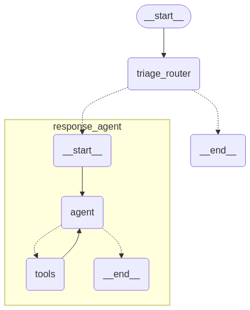

# Email-Agent

## Overview

This project is a Python-based email agent that uses LangChain and LLMs to automate email-related tasks.

The agent is designed to be flexible and adaptable, allowing it to learn and improve its responses over time.

## Features

- Email Classification: The agent can classify emails based on their content, sender, and recipient.
- Email Reply: The agent can reply to emails based on their content and sender.
- Email Scheduling: The agent can schedule meetings based on their content and sender.

